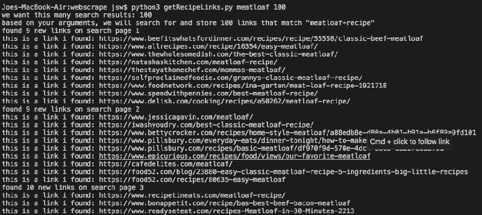
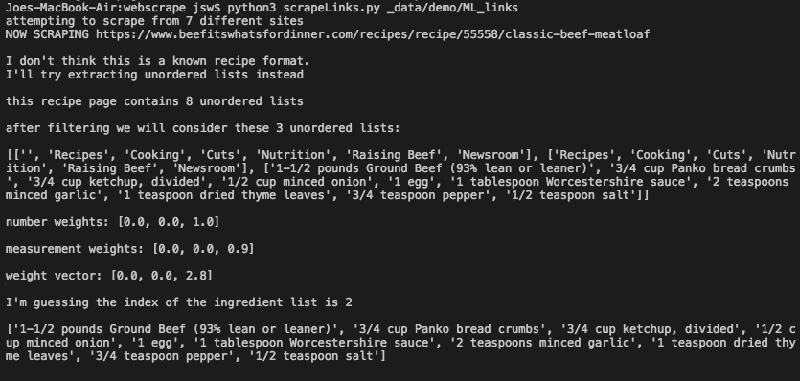

# Recipe_Analysis
Building a Better Meatloaf... 

This is a long(ish) term project based on applying data analysis, web scraping, and other computational methods to a strategy I use for cooking in everyday life. 

When considering making a food (for example, meatloaf) for the first time, I often quickly google recipes, open anywhere between 5 and 10 different recipes in browser tabs, and try to get a broad overview of the food. What ingredients are absolutely essential? Which can be varied or skipped? Which recipes seem "standard" and which are interesting variations. 

I wondered what kind of insight I could glean, or how I might choose recipes differently, if I could expand this strategy and apply it to, say, 1000 recipes? Sure, there might be some good recipes on the first few pages of google, but what if there are some hidden gems on page 100? 

This project attempts to build a large data set of recipes for a single food, then allow a user to navigate it by looking at the ways in which elements in the data set converge or diverge from some kind of 'norm.' The backend is built in Python.  

## Current Status / Code Modules: 
* **getRecipeLinks.py**  runs from the command line with arguments (foodname, num_results). For example, when you've downloaded the code and are in the correct directory, type "python meatloaf 100" to get generate a text file with 100 unique links from the google search results for "meatloaf+recipe"* 

  

* **scrapeLinks.py** visits each of the links in the text file generated by getRecipeLinks.py and attempts to extract the recipe from the page. Common websites (e.g., allrecipes.com, foodnetwork.com, etc) have templates that allow for easy scraping. Arbitrary websites are scraped using strategy that attempts to located unorderd HTML lists and analyze them based on the presence of numeric data and "measurement words" (for example, we expect recipes to contain words like "teaspoon," "ounces," "grams," etc), in order to "guess" what text contains a recipe. So far the code is 80-85% accurate in its scraping. Room for improvement... 

Generates two files, named "results" appended with a timestamp. ERROR_LOG shows all the links that weren't successfully scraped. 

  

* **iAnalysis.py** Ingredient Analysis: takes the textfile output from scrapeLinks.py and attempts to standardize the ingredients. That is, it organizes all strings representing ingredients and uses various strategies to group ingredients. For example, it will designate "black pepper," "fresh cracked pepper," and "ground pepper" as the same ingredient. Then all recipes are stored in the same format, a list of python dictionaries with this structure: {"amt": numeric_quantity, "unit": unit_name; "name": ingredient_name"}. This code also runs preliminary analytics on the batch of recipes parsed, reporting the degree to which recipe ingredients have been consolodated and ordering ingredients by how often they appear in the batch of recipes. Takes a filepath argument, ie run "python3 iAnalysis.py data/scraped_cheesecake" 

UPDATE: Added user correction option after automated ingredient consolidation. The consolidation of ingredient strings will always be imperfect, though I plan to incrementally add more involved analysis (NLP, ML, etc). For now, let's be humans and correct obvious errors... 
  

  

* **load_recipes.py** takes the output (binary) file from ingParse.py and loads the recipes and ingredients into  SQL database (you can create the database/required tables by running the script **init_DB.py** with configuration setting that work on your end). Takes a filepath argument, ie run "python3 load_recipes.py data/results_from_wherever" 

* **ingParse.py** has some helper methods to parse ingredients in some of the above code (for example, extracting numbers, rendering fractions as floating points, stripping out special/annoying characters, etc). 

## Sample Data:

* the **sample_data** folder contains two text files generated by scrapeRecipeLinks.py. One contains 37 recipes for challah; the other has 96 recipes for meatloaf. These can be used to test iAnalysis.py. Note that both are imperfectly sorted (by the automated procedure), but the larger dataset (meatloaf) has fewer "misses" when it comes to sorting. While every type of recipe is different, this is because the consolidation should work better the more data is loaded at a time (since we have more ingredient strings to compare, etc)

## Required Libraries: ##
For headless webbrowsing, I'm using [Selenium](https://selenium-python.readthedocs.io/installation.html). For parsing HTML, I use [BeautifulSoup](https://www.crummy.com/software/BeautifulSoup/bs4/doc/).

All other libraries should be part of standard python distribution(s). 

## Forthcoming: ##

* Linking **iAnalysis.py** to the database so it gets "smarter." That is, as more recipes/ingredients (and their aliases) get added to the database, the program should get better at consolodating ingredients since it's 'seen' more synonyms for the same ingredient.  

* Front end! Working on getting this online so that users can query the database I am constructing and visualize some of the results. 
