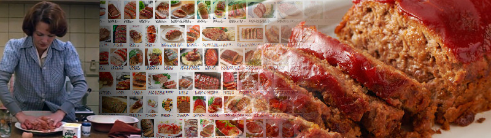
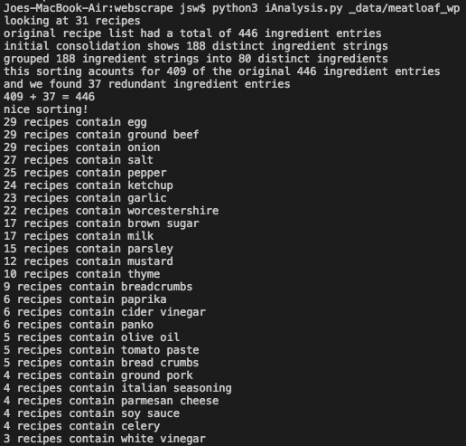

# Recipe_Analysis
Building a Better Meatloaf... 

This is a long(ish) term project based on applying data analysis, web scraping, and other computational methods to a strategy I use for cooking in everyday life. When considering making a food (for example, meatloaf) for the first time, I often quickly google recipes, open anywhere between 5 and 10 different recipes in browser tabs, and try to get a broad overview of the food. What ingredients are absolutely essential? Which can be varied or skipped? Which recipes seem "standard" and which are interesting variations. 

I wondered what kind of insight I could glean, or how I might choose recipes differently, if I could expand this strategy and apply it to, say, 1000 recipes? Sure, there might be some good recipes on the first few pages of google, but what if there are some hidden gems on page 100? 

This project attempts to build a large data set of recipes for a single food, then allow a user to navigate it by looking at the ways in which elements in the data set converge or diverge from some kind of 'norm.' The backend is built in Python.  

## Current Status / Code Modules:## 
* **getRecipeLinks.py**  runs from the command line with arguments (foodname, num_results). For example, when you've downloaded the code and are in the correct directory, type "python meatloaf 100" to get generate a text file with 100 unique links from the google search results for "meatloaf+recipe"* 

* **scrapeLinks.py** visits each of the links in the text file generated by getRecipeLinks.py and attempts to extract the recipe from the page. Common websites (e.g., allrecipes.com, foodnetwork.com, etc) have templates that allow for easy scraping. Arbitrary websites are scraped using strategy that attempts to located unorderd HTML lists and analyze them based on the presence of numeric data and "measurement words" (for example, we expect recipes to contain words like "teaspoon," "ounces," "grams," etc), in order to "guess" what text contains a recipe. So far the code is 80-85% accurate in its scraping. Room for improvement... 

* **iAnalysis.py** Ingredient Analysis: takes the textfile output from scrapeLinks.py and attempts to standardize the ingredients. That is, it organizes all strings representing ingredients and uses various strategies to group ingredients. For example, it will designate "black pepper," "fresh cracked pepper," and "ground pepper" as the same ingredient. Then all recipes are stored in the same format, a list of python dictionaries with this structure: {"amt": numeric_quantity, "unit": unit_name; "name": ingredient_name"}. This code also runs preliminary analytics on the batch of recipes parsed, reporting the degree to which recipe ingredients have been consolodated and ordering ingredients by how often they appear in the batch of recipes.  

...

## Forthcoming: ##

#currently building MySQL database to store scraped data and an interface to continue to add data to the database over time. 

#Front end! Working on getting this online so that users can query the database I am constructing and visualize some of the results. 
